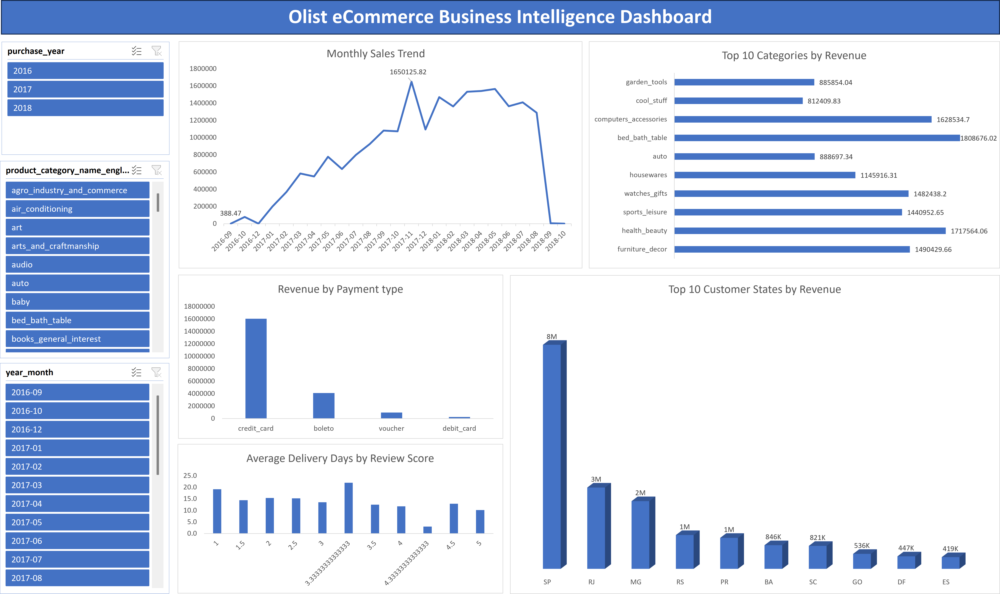

# 📊 Data Analyst Portfolio

### Excel • SQL • Power BI

---

Welcome to my data analyst portfolio. This repository showcases hands-on projects in **Excel**, **SQL**, and **Power BI**, each built to demonstrate practical, end-to-end analysis: from raw data to clear, decision-ready insights. Browse the projects below or visit the live portfolio site for interactive previews.

---

## 📂 Featured Projects

Each project below includes a short summary. Click through to the repo for full documentation, code, and screenshots.

### 1️⃣ Olist E-Commerce Analytics Dashboard (Excel)
**`📁 /excel-olist-ecommerce`**

> Dynamic Excel KPI dashboard and data model analyzing multi-million dollar e-commerce sales, logistics performance, and consumer payment preferences.

  

- **Goal:** Demystify e-commerce marketplace operations for Brazil's largest platform integrator (Olist) by consolidating over 99,000 fragmented relational order records into a centralized executive dashboard that tracks revenue velocity, regional growth drivers, and payment channel distribution.

- **Approach:** Cleaned and modeled raw multi-table relational datasets using **Power Query** to establish an optimal star schema. Engineered performant aggregation layers using **PivotTables**, implemented dynamic **KPI Summary Cards** via cross-sheet formula mapping, and deployed an interactive sidebar panel containing globally linked **Slicers and Timelines** to enable seamless cross-filtering across all visual elements.

- **Outcome:** Successfully mapped regional economic engines, identifying that **São Paulo (SP)** anchors the highest ecosystem value at **$8.01M**, outperforming secondary hubs like **Rio de Janeiro (RJ)** ($2.90M) and **Minas Gerais (MG)** ($2.42M). Isolated major consumer trends showing that **Health & Beauty** leads sector revenue at **$1.71M** and that credit lines heavily dominate platform velocity, capturing **$16.05M** in total processing volume compared to **$4.08M** via traditional bank invoices (*Boleto*).

**Skills demonstrated:** `Excel` `PivotTables` `Power Query` `Data Cleaning` `KPI Dashboards`

🔗 [View Project](https://github.com/Unclerozay/unclerozay.github.io/tree/main/excel-olist-ecommerce)

---

### 2️⃣ Global Healthcare Impact Analysis (SQL)
**`📁 /sql-global-healthcare`**

> Advanced relational queries on Kaggle epidemiology datasets to track rolling metrics and transmission trends.

  

- **Goal:** What dataset/database were you querying, and what business question did it answer?
- **Approach:** Window functions, CTEs, and deep joins to engineer data pipelines tracking rolling metrics and transmission trends.
- **Outcome:** What did the queries reveal? Tie it to a decision or metric where possible.

**Skills demonstrated:** `SQL` `Window Functions` `CTEs` `Query Optimization` `Data Modeling`

🔗 [View Project](#)

---

### 3️⃣ Enterprise Talent Retention Dashboard (Power BI)
**`📁 /powerbi-talent-retention`**

> End-to-end business intelligence solution using Kaggle HR infrastructure data, tracking workforce optimization and predictive turnover metrics.

  

- **Goal:** What decision-makers needed visibility into, and why.
- **Approach:** Data sources connected, data model design, DAX-driven measures, interactive dashboard structure.
- **Outcome:** What the dashboard enables, e.g., real-time tracking of turnover risk, self-service workforce reporting.

**Skills demonstrated:** `Power BI` `DAX` `Data Modeling` `Dashboard Design`

🔗 [View Project](#)

---

## 📫 More

🌐 **Full portfolio with live previews:** [unclerozay.github.io](https://unclerozay.github.io)

*Thanks for stopping by. Feedback on any of these projects is always welcome!*

